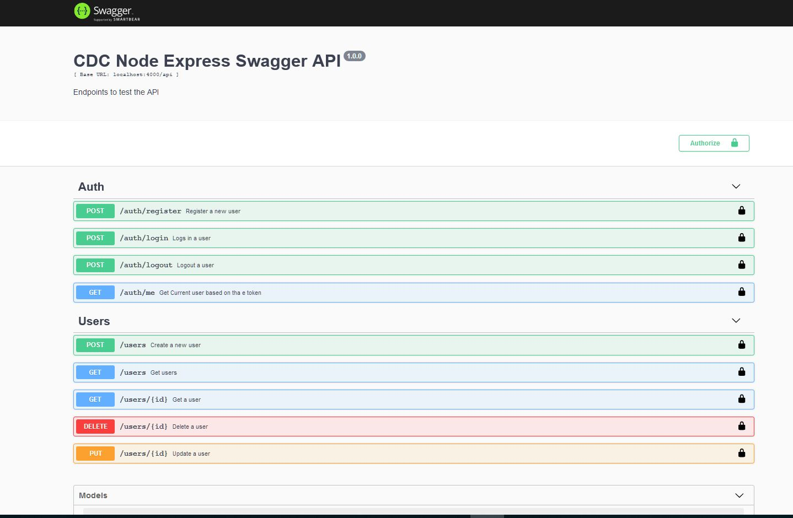
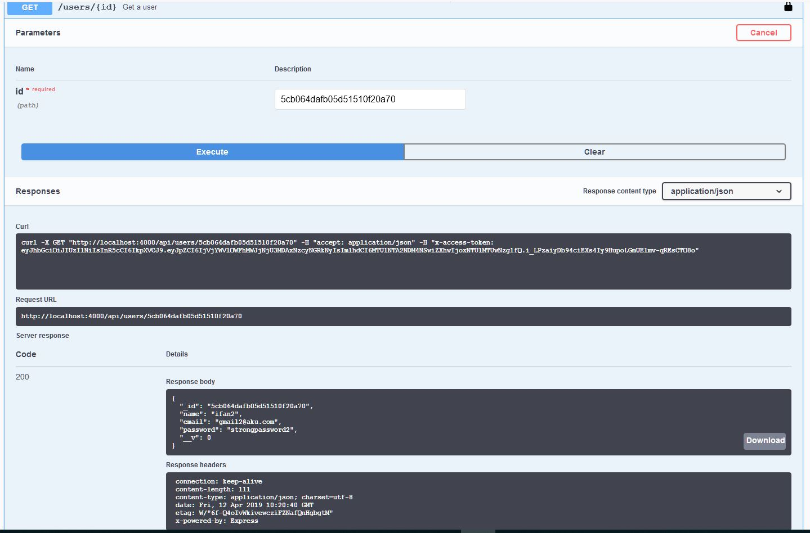

# WebAPI ExpressJS using JWT (Json Web Token) 
Sample project using node js express and mongodb with JWT authentication

## Prerequisites
already have nodejs installed

install express and mongo
```
npm i --save express mongoose
```

## Getting Started
run bellow command:
install express genertor
```
npm i express-generator -g
```

init the project (for web api using option no view)
```
express appName --no-view

npm i
```

after project structure generated run 
```
npm i --save mongoose jsonwebtoken bcryptjs
```
to include moongose(for mongodb connection), jsonwebtoken(for generate token), bcryptjs(to securing password in db)

```
npm start
```

## Setup swagger on as API documentation
install swagger-jsdoc and swagger-ui-express
```
npm i --save swagger-ui-express swagger-jsdoc
```
setup swagger config on the app.js and the documentation for each root by using @swagger syntax

Below are the last result https://nodeexpresssample.herokuapp.com


user can invoke the api



## setup deployment on heroku
1. Create heroku account
2. create new app on heroku
3. install heroku CLI
4. push the code to git repo
5. login to heroku from CLI
```
heroku login
```
there will be browser popup that require to login to heroku
6. create heroku git remote
```
heroku git:remote -a {herokuAppName}
```
7. deploy to heroku
```
git push heroku master
```


